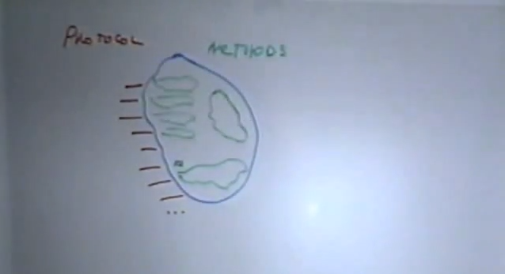
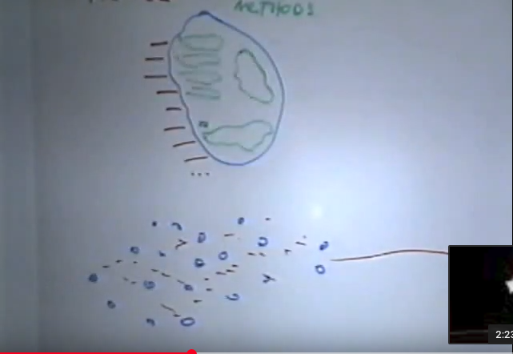
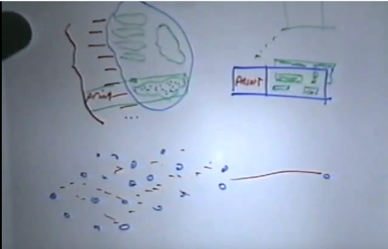
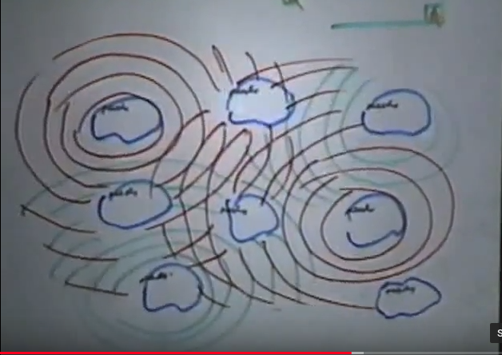
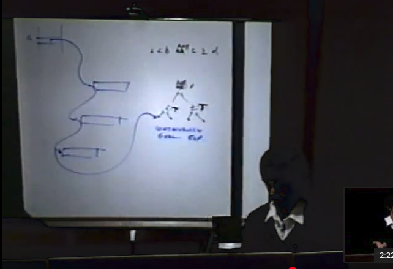
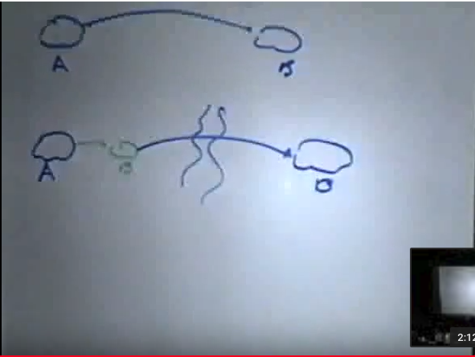

## [Seminar on Object Oriented Programming](https://www.youtube.com/watch?v=QjJaFG63Hlo)
Note: This talk presents how Smalltalk group at PARC was thinking about OOP during 70s and 80s (and beyond).

### First known form of OOP
I wrote my first program that I would call object-oriented in 1962 and people have been writing programs in that style even earlier than that. In my particular case I was a programmer in the Air Force at Air Training Command in 1962 there were no standardized operating systems (of course that's true today). But back then there was actually a reason for it nobody had gotten around to the idea of thinking it might be useful, and Air Training Command had a problem of moving tapes with records of various kinds on them from one Air Training Command base to another. The machines back then Burroughs 220, which were machines that have had about five thousand characters of storage and were about the size of this room and were great coffee warmers. My image of them is with this huge set of boxes with a row of pots on top trapping the heat as a came out.  Now the problem that they had was that there is no way to standardize on what the formats of the different records were. They changed and the operating system. It was usually just the kind of a loading program and so there was no way of standardizing on that and they wondered how can we actually read these data records if everything is constantly changing and nothing holds still. Somebody thought up a great idea. That idea was to have the records shipped in the following format. Each tape file had three sections to it: the front section was fairly short, it had a bunch of relative pointers into the second section which contained bunch of Burroughs 220 code and that code knew how to deal with a third section which had the actual data records. There are usually about 20 or 30 what we would call messages today. 20 or 30 entries in the first part and the code that came along with the tape records knew how to deal with all the data. **So in current day terms what the Air Training Command was doing (I think it was as far as the late 50s) was to ship an entire class of objects. The class was shipped with the protocol, with all of the code, and with all of the data in a form in which you did not have to penetrate any of it in order to make use of it.** That was used for a number of years as a technique until COBOL came in and the Air Force forced all of those good ideas to go away in order to standardize and COBOL which is a much weaker conception going back to the notion of data structures that are fragile.

### Encapsulation
Our bodies have approximately a trillion cells in them and each cell is rather complex. Each cell has many millions of components in its own right so one of the ways nature discovered to control complexity and the kinds of interactions that are likely to happen is to try and encapsulate them in various ways. This is a familiar principle to us. It's something that we use in regular program as well. Trying to encapsulate and the question you're always asking when you encapsulate, we're going to ask this quite a bit later, is just what is encapsulated. what kinds of things are we trying to control are usually in regular programming what we encapsulate are sections of programs that occasionally will encapsulate with regard to a protocol for dealing with some system we don't want to inquire about the internals of. **What biological systems encapsulate is the actual environment in which most important processing takes place. There are very few object-oriented programming languages that go that far. The average object-oriented programming language encapsulates not the environment but in fact something like the state of a data structure along with the procedures that know how to intimately manipulate it and try and tie those two areas together in a way that they cannot be penetrated from the outside.** When people speak of an object-oriented programming language like Objective C or C++ they're talking about even less than that because there the encapsulation is almost a convention. It's done by means of macros, the amount of protection at runtime that is delivered is rather low, so there all of these gradations. Now biological systems encapsulate with a vengeance because nature discovered that if you give each cell its own little captured ocean and let it devote about 90% of its actual energies to simply protecting itself from the outside world as though the outside world were hostile then you get a situation where you can build very large structures rather safely, and
encapsulated is not just the saline solution, not just the organic molecules, but also encapsulated not just the programs that drive the cell but in fact encapsulated in biological organisms as many of you are aware is **the entire plan for the entire structure.** Now we don't generally do that when we write an object-oriented program but in fact people are starting to do that now in artificial intelligence.

### Basic principle of recursive design

There's a principle in design that people came up with many years ago, it's called the basic principle of recursive design and the idea is make the parts have the same power as the whole. We know in the factorial example that a recursive program like factorial, it's charm is it's able to reinvoke itself as the conditional branches and so in some sense, as long as that is true, the program remains as stong as it was when you entered it, because you can always reenter it instead of getting diluted away. Now another thing that that crossed my mind when I was pondering these ideas back in the 60s was why if that is such a powerful idea, why is it that we take a very powerful idea like a computer and dilute it immediately in most programming languages by dividing it up into data structures and procedures. Data structures don't have the same power as a computer. They're static, can take on marks, but they're once you get a data structure, it just sits there. Procedures don't have the same power as computers because they can't remember state. They have to have something additional so what we did in the guise of following standard mathematical notation in the 50s when Fortran was developed was to mimic standard mathematical notation without thinking about this basic principle of recursive design because people didn't write recursive programs back in the 50s, and so the baby is thrown out with the bathwater almost immediately in a standard procedure and data structure language. And it occurred to me and other people who are thinking about these ideas back then what if you didn't do that, what if the only subdivision you ever made in a programming language was a subdivision of a computer into a computer. You're never allowed to subdivide the computer into something that was less than the computer. And what does that mean? That means that each subdivision has to be something like a black box that has inside of it some mixture of state and process. From the outside you can only invoke behavioral attributes rather than invoking method attributes. And what I mean by that is this is something that was even in Fortran because the earlier designers of Fortran realized that there is a very funny correspondence between procedural things and data structure things so for instance when you say sin(30) in Fortran you can't tell by looking at that whether you're invoking a function or whether you're accessing an array. And that was not accidental back then because of course they thought of arrays as being a kind of a function and they wanted you to be able to write arrays (huge tables) still done today in order to do functional evaluation very quickly. What they didn't realize is that you wanted to be able to trade-off between the two, but that notion of just saying sin(30) without indicating how it is to be computed is the essence of the kind of abstraction that object-oriented programming is all about. It's carried very far here by this strong membrane of the object so that what we're dealing with here are behaviors ...

### Messages in most cases cannot be commands

Messages in most cases can't be commands or you're violating the notion of the object as being in control. Now most object-oriented systems today when you do what is called sending a message you are issuing a command. Objective C, C++, even Smalltalk 80, in all of those systems a message is actually something very close to if not identical to a certain kind of procedure call. But in fact in the original scheme, we can talk about the implications of why this is a good idea, in the original object oriented systems that were so successful messages aren't commands at all, what they are are desires
(I'd like to have this happen). Just to give you an example of why, imagine we have an object masquerading as a critical system file, and the question is, should just anybody be able to come up and issue the command to it turn byte 5 to 0? Now it's done all the time but in fact in an object-oriented system you would like the object to be able to protect itself so that even a person who has a pointer to it, even a person who has the knowledge of which command is the right command, that both of those do not imply that you have permission to actually change that file, so when I talk about an object-oriented system I mean an object in which the worst you can do to an object is to simply indicate to it that you would like it to do something for you, and the best that can happen is it will do that. The worst that can happen to it internally is it will simply refuse it, may take your name and give it to the principal later if you've done something wrong ...

### Assignment has to be replaced by "advice"

Because the object is no longer a data structure in any sense that we regard it, assignment is something that can't be done from the outside either. So the assignment statement has to go away in the form that we know it as an irrevocable change to a variable or a slot in a data structure. An assignment has to be changed by something that we can think of as being advice or influence. So again this notion of getting an object to change it's state is something that we normally don't do in object-oriented programming because normally in object-oriented programming we are not simply trying to imitate data structures. Now to be a data structure is that thing that if you send it to somebody else, you're giving them permission to change it that's what I mean by a data structure. So it's clear that some of the things that we call data structures in normal parlance in a system with an operating system that offers some protection, are not strictly classical data structures by that means. Certain files usually have protections on them so that in a good operating system when we send a file from us to somebody else we are not can conveying to that person the same level of protection necessarily that we have been granted.  So in a good operating system, this may be an operating system that you've never seen, but there have been operating systems in the past, there exist operating systems now, so that if you have a certain set of permissions for a file and you wish to give it to your friend (suppose you have the the magic permission to change the any byte in the system file because you're a honcho) then you might wonder should I be able to pass on those permissions to the next person that I give this file to.  The answer for good operating system is no. Each person should get their own permission separately and when they receive this file, it's their permissions that are granted by the operating system that obtain, not the permissions passed on to them by somebody who had the file before. So you can think of taking this desperately important file, passing it along and when it goes to somebody who is less to be trusted with it, they have fewer permissions on that. There are fewer things that they can do with it and then they pass it on to somebody again that may go back to a trusted person, that person should be able to reinvoke those operations that were taken away. There are whole schemes for doing this, and is called capability protection. Capability protection is again another one of these old ideas from the 60s, intertwined in a very strong way with object-oriented design that is now coming back. Capability is simply a technique for protecting objects in a stronger way than normal digital computers allow them to be done.

### Reasons for dealing with objects
Probably 90% of the reason to me for dealing with objects at all has to do with their abilities to protect in various ways.  Protect by encapsulating various kinds of things, almost always state, less often control is encapsulated and so forth. Then about 10 percent of the use of object-oriented programming has to do with its ability in whispering to you how you might design a system better.

### Data abstraction vs OOP
The way objects are used today is a little bit confusing because they're intertwined with a another set of ideas that came out of the 70s that are very similar, particularly in implementation these days and that's what's called data abstraction.  
Data abstraction looks a lot like object-oriented programming but its intent is different. The intent of data abstraction is to take a system that you're familiar with, like Pascal or Fortran, that is starting to run into difficulties of various kinds. Difficulties are usually a representational ones. I think everybody had the experience programming in a language with data structures. You get this big system done, you decide you need to change your representation and the next thing you know you're hunting down all of the procedures that think they knew about the old representation and the rule of the universe is that there's always one or two that you don't find so you slide in the new representation and a couple of months later one of those procedures is invoked and all of a sudden you have a crash and people wonder why. The answer is the critical knowledge has actually been spread out in such a way that it can't be recovered. It's like what you have to do after you do a multiplication, in order to recover the operands you have to do much more work. It is like the difference between differentiation and integration. The same thing is true is once you've lost information in a system, once the entropy has
gone up, then it's very hard to get it back. So one of the things that you do with objects is to maintain as much informational content as you possibly can in a smaller place as possible. Now data abstraction techniques use a similar way
of wrapping an envelope around a data structure and invoke operations by means of procedures in order to get it to be a little bit more representation independent. Ada for instance is a language that is a data abstraction language, it is not an object-oriented language and even the the people who actually understand Ada don't claim that. But you can do certain kinds of things that are now today called object-oriented in Ada. So this envelope of procedures is wrapped around the data structure in an effort to protect it, but then what happens is that this new structure that's been created is then treated as a data structure by all the rest of the program. The result is, particularly in Ada, is that the programs are not small. The programs aren't any smaller than they were before, and one of the hallmarks of object-oriented programming if you have any sense of whether you're doing it right or not, is that the programs are remarkably smaller because there's a way of using the design that is not simply imitating a bad old idea which is data structures and trying to shore it up by putting it in an orthotic brace, but in fact to go beyond the notion of data structures. So for instance in a Ada way of of doing object-oriented programming one typically comes out with something that looks very much like a data structure. It has fields that are to be written to, it has fields that data is to be taken out of, the structure is static, there's no actual process going on, and it's essentially a slightly more abstract way of doing data. Typically, a good object will not actually permit you to write assignment statements to it at all because an object generally will not look at all like a data structure. Just to give you an example, we can contrast a personnel record as it might be done in Ada in, which we still wind up with fields as we had them before. Some of the fields might be a little bit more connected, but it's still a large thing. It's still passed around as a passive object. We could contrast that with an object-oriented approach with which would be to turn the personnel record into something much more like a real person. In other words, this personnel record instead of sitting there on a file waiting to be manipulated would actually be trying to participate actively in some sort of simulation. Instead of changing the person's age from the outside, the way you might do in a data record, the age of the person would change dynamically as the birthday was passed because there was something in this object that was actively looking at the clock, actively running in some sense. The notion of being able to edit the object from the outside would be much less in the sense of editing the actual fields, so objects even in a programming language in which everything is an object like Smalltalk tend to be larger things than data structures. They tend to be components, active machines that fit together with other active machines to make a new kind of structure.

### It is one thing to build cells and another to build tissues
To me this is what object-oriented programming is about. It's not saving data structures from itself, it's not making a slightly fancier data structure, it's not even making a data structure that can implement certain kinds of constraints within itself and so forth. It's thinking of those objects as independent machines. Going back to this whole biological notion that it's one thing to build cells and it's another thing to build tissues and for people who are just starting out in object-oriented programming they're usually thrilled that they can build cells but the real goal is to be had when you move from cells to thinking about what are the tissues what are the conglomerations of these atomic style objects into components that if you were to have three or four hundred of them in a repository usable by any programmer, what would you be able to build. Could you be able to Tinkertoy things together, could end-user programmers be able to do a considerable amount of the programming and retailoring and so forth.

### For programming in the large objects aren't enough
The reason is that at some point it's not simply a matter of piecing together something that is supposed to run it's a matter of being able to verify different sections, different parts, different modules independently, to be able to unplug and replug and even I think in many cases it's desirable to allow different implementation languages to actually used.

### Separate outside from the inside, protocol from methods
The main principle in object-oriented programming is to separate the outside from the inside, so on the outside we have a variety of messages that we're willing to respond to, and on the inside we have some methods that may or may not correspond to these things on the outside because whatever the idea is we're not supposed to understand what the inside looks from looking at on the outside. And outside thing might even correspond to a little data structure inside a thing. Equally innocent might correspond to an enormous amount of code. There might be code in here not directly connected to this and in fact some of the messages that the object may be able to receive aren't directly characterized in terms of some outside protocol. Lots of different variations here but the most important one here is that we're trying to separate a protocol from some methods at this level.

### Protection does not guarantee that you have an architecture
We started having zillions of objects interacting in a sea of messages. In fact some of the objects might not even be on the same machine, they might actually be over here. **In a good object-oriented system you shouldn't be able to tell what machine you're running on. That's what messages are all about.** Very quickly when we're starting to build a large system down here we've got something interesting, we have absolute protection but we still have confusion because you can have thousands of diamonds that are impervious to all normal wear and tear and still not be able to build the simplest structure out of them. They may be too shiny, may not be able to pile them up, they may not fit together, but they're perfect. So what I'm trying to say is that the protection issue is a critical one, but it still doesn't guarantee that you actually have an architecture. 

### Protocol is the most important and most fragile part of object-oriented design
How complicated protocol gets is the most important part in any kind of object-oriented design but it's also the most fragile. The fact that there's nothing to protect print is absolutely critical. Let me give you an example of what we could do to protect print. One of the things we could do is instead of having print just be code, we could actually have a print class and it's offspring, it's instances are actually structures that look like this. In other words each offspring of print is a message-method pair in which unrestricted code writing over here is not allowed. This is interesting idea because if you can write anything here then J. Random Programmer often will as you go along and the fact that the system seems to be conventionalized at this protocol-message level, which is the very charm of object-oriented programming, why object-oriented programs work so well, why they fit together gets destroyed as the amount of generic information in the actual methods gets diluted. But another way of doing an object-oriented system is to actually make classes for each of the major code types that you're going to write and what you get here is something that would insert itself in here, but in fact the only codes you're allowed to write are certain little restricted boxes in here, and this thing guarantees that it's going to print for you. It's not going to go off and zero byte five of some system file. Because it came from a print class and because the print class does printing type things every piece of code that goes into a protocol actually is going to do something like printing and what you're allowed now is a certain amount of parameterization, a certain amount of freedom, but the meaning of print now has been nailed down because there's some actual code from the print class sticking behind here that you can't see, that's going to make every effort to deliver a result. This is like types in typed languages except it's stronger because it can controls the goal of the result, the goal of the result not the shape of the result. In a typed language when you have a typed variable or typed procedure, what you can state is that might have some integer parameters and I'm going to deliver a floating-point result, what you can't say in the typed statement is what the intent of that procedure was. The only intent that you could indicate is that it's going to give you some sort of floating-point result. You can't say it was supposed to give you a sine or cosine or anything else. That is up to the convention of the actual programmer itself so what I'm just pointing out here is that if you take a system in which there is a protocol, you can get a lot out of it just by having the protocol be a convention, agreed on by everybody. As you go into a larger and larger system that inside-outsideness will protect against the inside getting dissolved by some hostile action by the outside but what will get diluted as you go to a larger and larger system with more and more programmers is whether the protocol is going to have any meaning. Practical example ... ParcPlace Smalltalk has approximately 5000 of these green things, each one of them can be
reused by inheriting it from somebody else. The number of red things it has is on the order of 2100. That means that the amount of how generic the code is with respect to the protocol is not much. The number should be more like 400 or so different red things (400 concepts) and say 5000 realizations of those concepts.

### Configuration language
Configuration language can be independent of all of your method languages. It's something that is dealt with at the operating system level, it's something in which the protocols are chosen as much as possible ahead of time, it's a standard vocabulary of concepts that you're going to use to write in, it's one in which the protocols are controlled by active code that give you places to write code and insert other code that allow you to bring over a COBOL routine or a Fortran routine or whatever the heck you want and bind it in. It's a binding mechanism, it's a way of setting up environments for debugging modules independently of each other, it's a way of assuring yourself that a module will be able to move from one place to
another, it's a way of discovering whether you want to use a module so at some point the ability for human to read this configuration language is going to be much more important than the ability to write it. ... I only know of one actually good configuration language that's been done, a language called C/Mesa which was done by the PARC computer science lab about ten years ago and it served exactly this purpose, and here are some of the things it can have there. Some things that you'd expect just from your previous experience. You'd expect that there would be some sort of message name for something you'd expect that there would be parameters so that you would have input expectations, output expectations. A good configuration language has executable predicate. You can think of as a goal that they may have a variety of them. When I say input expectations I mean not just the types of the parameters that you expect to send to it and the types of the results, but also preconditions on the input side and goals on the output side. You can think of those as being executable. There are environmental expectations. One of the difficulties in most object-oriented programming languages is although you can protect an object, what you don't have any sense of when you want to move an object is what the object itself expects to have as environment.

### Modularity in object-oriented programming is slippery
In Smalltalk you can write an object, move it for one place of a particular Smalltalk system to another, but when you want to take it out of your Smalltalk system and give it to somebody else, a Smalltalk system you often are unpleasantly surprised. And it's not that the object has been solid in any way, it's that it has some other assumptions about it's environment that you weren't thinking about before. In particular, Smalltalk allows you to do the somewhat obscene thing of allowing you to go and change existing super classes to make them more the way you like. The benefit of this is that every class and the system feels this improvement and the problem with it is if that improvement is important then you've all of a sudden have done away with your portability, so what I'm trying to point out here is that the modularity you get in object-oriented programming is slippery and one of the most critical things to do is to be able to pin down the amount of modularity that's actually there. People have designed configurations languages in such a form that you can actually from the runnable parts of the stuff derive an explanation mechanically of what the method and what the module itself is supposed to do.

### Inheritance
Inheritance is in object-oriented languages is how you share things. It has been a goal of people in the last 20 years who do this to write very small, very reusable, very compact code. The goal is to make things that are shared as abstract and inheritable as they can possibly be. So you want the smallest number of maximally indepenent concepts that you can Tinkertoy together and have some confidence that the active Tinkertoy is going to give you something that also still works. The whole idea in object-oriented style is to linearly combine things together. 

### Modularity of control
In most object-oriented systems the modularity that is gotten by them is one that is regard to the state that you put in  each object. What isn't modular is the control. This is another set of issues to talk about. So for example one of the things that you may see when you're looking into an object-oriented programming is you may see the state and each neatly encapsulated but you may see control going all over the place. What happens when you send a message? The answer is often, I don't know. Goes here, goes there, and find somebody here, talks to this guy, dozens of things happen. And I can't even tell whether control is ever going to get back to me. That's often the state of affairs. Now what would happen if we actually made control modular? We'd have something more like this, where instead of control going through the objects, the objects themselves are sitting in a sea of messages but they don't actually originate them themselves. How is that possible? Well one way you can imagine for it to be possible is for the objects to simply say I need to know the following. Object-oriented system we've just developed at Apple, one that we did at MIT, is an object-oriented system in which you never send a message, only receive. How is it possible? Well the system contrives to make the messages get to you by looking at your needs and looking around to see who might supply those needs. Suppose your a button whose job is to move the corner of a window. So one of the ways of programming that is for you to be in a loop, constantly looking to see if the mouse is coming into you. It's a polling solution to the problem where somebody is polling somewhere but you're constantly looking to see whether the mouse is coming in. When the mouse comes in then you say, now I know what to do. I'm going to latch on to the mouse's coordinates and, I'm going to tell my window owner exactly how he should be moved around and so as we move around the corner, the window corner moves around itself and so that's this kind of style of programming. Control is explicit. We have to poll to find out things that are going on. The other way of doing it is I could just say I need to know when the mouse comes in to me and then I can do my job. This is like an on condition. But it's an on condition that has to be scoped because we can't have it happening every time, for instance the mouse button goes down. But we can imagine that this guy can say, I have a set of conditions, I'm not going to explicitly look for it, I'm just going to tell the world that if I had these conditions come true for me then I would be able to fulfill my obligations to the rest of the system. I'd know what to do likewise. The window that encloses this guy could also have a set of conditions that say, if my corner starts moving I should probably move too, I'll change my size if he moves so if only somebody would let me know that hen I'll go along. This is like this is like constraint programming. We're going from a procedural style which controls past explicitly, to a declarative style in which we are simply indicating needs and the system without having to do any problem-solving is picking up the slack by providing the actual information in the forms of messages. HyperCard has this about half way. It's a technique we've been experimenting with at Apple for the last couple of years and what it looks like it's able to do is to completely remove the necessity for actually being able to follow a control flow. What does this mean when you move an object from one place to another? When you move an object from some place into this kind of situation nothing is going to happen to that object unless you go in and recode somebody else in order to send it some messages. So my modularity of being able to move an object from one place to another depends on me being able to do some kind of modification and the system is already there. That's not so good. It's good in the sense that this object is guaranteed not to hurt anybody and it's going to protect its own self from being moved around, but in fact I still have to go in and make some sort of modification in order to get control the flow. When I put in a new blue guy here and he has all his needs specified, is he going to be able to run and why? Whole idea is that he's not intertwined with anybody else's control. He's simply saying, I know what I need.  Then the question is can the system actually deliver those needs just because he's a new thing and the answer seems to be yes. This is a peek into the object-oriented programming of the next couple of years.

### Spreadsheets
The motivation came from a couple of years ago  wondering why it was so easy to program in spreadsheets and wondering what spreadsheets would be like if there are more object oriented. I've always thought of the spreadsheet cells as being almost an object and spreadsheet cells have this nice characteristic that they are ... In other words the very act of writing the spreadsheet expression indicates to the rest of the spreadsheet system what your needs are. Now usually they're pretty simple needs. They're just, I need to know the values of so-and-so cells relative to where I am, but I got interested in generalizing that, and started off with a spreadsheet system that I did in Smalltalk that had a spreadsheet optimizer that first started off simply trying to look at places you wanted to get values from and building a propagation network rather than executing every cell every for every change. Spreadsheets today do not execute every cell. There's a propagation network built by the spreadsheet compiler that you don't see, that tries to find you the minimal number of things that have to be executed every time the change is made in the spreadsheet. I started working on that. 

### Continuously evaluating expression
And then the next thing is to go to booleans where you're interested in for instance whenever this is equal to that I would like to do something, or whenever this is less than that I'd like to do something. And I'll just give you a hint of it. So they start out with this fairly simple idea that if you have a variable somewhere, one of the things that you can do is to link to all of the different places that ever need the value of that variable and when this changes you simply fire off all of these guys and you get the desired result. Let's take an expression. Now so we take an expression like "a < b or c >= d". Then we ask what we'd have to do to that to make that efficient. The answer is you make this thing into a little tree and at each stage each node of the tree you hold the value of the things so far. So in this case the a value would be linked through here and you can think of the tree is pointing upwards. Let's just for the heck of it see that this is false and we assume that this is true and that this is false. Let's do it the other way I make this true, this false, so the idea is now, if it changes the insight here is that all you have to do is compare it to whatever the current value of b is, let's say this goes to to true, you don't have to recompute this guy because it didn't change, it's already part of this frozen result and then you come up and recompute this guy so what you basically have done in this technique is to have sorted the actual computation that you have to make. This way of doing things is called a continuously evaluating expression. So it's a conglomerate of things, it's actually a little computation engine designed to compute in parallel and only the stuff that needs to get computed. The compiler instead of compiling machine code in a system like this is actually compiling a propagation. For people who are interested in these techniques, I refer you to the books on functional programming mostly being written in England these days. Functional programming is about this and well-behaved functional programming languages have the property that you can take any computation that has variables in it and through a fairly simple compilation change it into a network that has no variables whatsoever but simply routings for values. Variable is a place you go to to get a value but of course what you really need in a computation is simply a value delivered you don't need the value to be anywhere except where the operator is, so by using a combination of those techniques you can ... actually remarkably enough it's actually always surprising when these things work ... you can actually go to a thing that's an extreme generalization of a spreadsheet cell that does an enormous amount of parallel computation but in a way in which you see none of the interactions yourself. 

### Time in OOP
What do you do with time? Historically the first object-oriented programs that were done outside of machine code were done in a programming language called Simula. Simula he had a bunch of objects, one for each entity that you're trying to model, so these guys might be modeling pipes, and the blue guys might be modeling reactors in a chemical plant or something like that, but basically as far as seeing they're all objects, they're all trying to execute at once, trying to advance the entire system time and they had this problem of if you have a system time, the system clock that's going on, how can you compute because you might actually run out of time for computing before you can actually advance to the next system time, so what people realized that they wanted to do was in between the system clock ... so system clock might be one and the next time any of these guys had to compute was two so what it would do is it would do all of the computing in between the ticks of the clock so the computing was actually outside the space of the simulation, so this is a non real-time situation ... Simula running on a mainframe would compute an arbitrary amount in between each state change so guarantee that each as much as it could possibly do it, would settle down the state of each one of these objects during this time when they were all in
process. As soon as that had happened then it would say, now I can go to the next time on the clock, it is now - what do I have to do now? Then the clock could be frozen would compute like mad again, advance the clock again. Now of course there's a huge conflict. That's the way you generally do it when you're doing object-oriented program. Huge conflict between this and when you want to do real-time things because real-time things you don't get to stop the clock. The clock is moving along
and of course one of the answers is, if you don't have enough computing power to compute before the next time the clock ticks then you're dead anyway. So let's assume that we have enough computing power and just to ask what we can do in an object-oriented design to reconcile what time actually means. The way people generally think about time and object-oriented
programming as time has entirely to do with who can view what when. So it's a viewing operation. So let's suppose we have our objects here and we have some views attached to the objects. We can ask what is it like if one object is viewing
another. The first question I just should ask everybody this is absurdly simple once you see it, but the first question is when should I not be viewing the object? When it's in transition, right. So it means I have to have at least a two-phase clock. So the object really has two states. It's going in one as it's trying to settle itself to what it thinks as a stable state and the other one is one that's going to allow itself to be viewed. We can do that and it's sort of a diagram here. So what we're saying is that when the object is computing we can't view and when the object is viewing we can't compute. That's not always useful. Sometimes this viewing thing is very long. So the viewing can actually hold up the progress of the computation and so what can we do there to break this rigid synchrony, we could arrange a slippage model so we let the object compute and what we take is a copy of it that we let the viewer view and so the object in simulation can have quite a number of phases as it goes along, and every once in a while we get to view it. What's interesting is in an object-oriented system this slippage model is usually computed automatically by the object in the view both of which are objects. When you hook the view up to the object what they do is exchange information because one of the things that the object has some sense
about is how long it takes to settle it's state. Typically the view has some sense about how long it takes to abstract the view and so they actually arrange and build a little buffer in between themselves and that buffer has the actual amount of information to allow the slippage to happen. So the way this intertwines with doing real-time and deterministic computing is almost all real-time solutions to queuing problems knowing some sort of determinism they actually aren't completely deterministic. What you usually do is you're saying, I have some limits that I want to guarantee the computation is going to take place in, between it I'm going to do enough buffering to make sure that those limits get down. So for instance when you're doing real-time reading of records from fast disks and so forth you set up buffer areas because you don't want to have to have real time constraints in every part of your real time computation. In an object-oriented system these are usually handled by having what's called a viewing model. Smalltalk has one called "models views and controllers" which is quite general and has the facilities in it for generating all manner of slippage models in between by you putting on the outside what it is that you actually need to know from these objects at some point.

### Really good superclasses don't do much except act as really good binding mechanisms
Superclasses are the ones that you want to have most understood and most nailed down. In particular for instance in
Smalltalk it's often to make things like the sorting stuff parametric so you're actually sending in sorting objects that will do sorting for you as parameters rather than embedding that into the the code just because you don't want somebody to
try and change it that way, you'd rather have it be something separate that you can dynamically bind in. Really good superclasses don't do much except act as really good binding mechanisms for other stuff that's going on.

### Phantom objects
Original Smalltalk for example didn't use a kind of procedure call in order to send, it really acted as though you're on a network and if you're interested in what order things had to be done in, they could actually be stamped and requeued at the other end and people do that when you run Smalltalk over the network, people make the connection to the network by having what are called phantom objects. Phantom object is a stand-in from the object you're trying to send the message to. 
So if you're over here and you think you're sending a message, what you think you're doing is sending a message from object A to object B. But they may be on different machines and so what may be really going on is object A is sending to a version of object B which is really going over the network to the real B. Again these are called phantom objects and usually there's just one class of them. Usually the environment for objects consists of a few local objects and the rest of them are phantom objects. Phantom objects take care of all the the network stuff and synchronizations and reorderings and other kinds of things that you have to do when you're going to slower slower media. That's a well-established technique and in any good object-oriented language you can set that up literally in an afternoon.

### Sending an object, not just a message
133:57oh it's quite instructive to think about
133:59what it means not to send just a message
134:02but to send an object from one place to
134:03another what part of its environment do
134:05you have to bring along with it in order
134:08for it to be understood see in theory
134:10sending an object let's say we send
134:14objects see across
134:20well si may not be terribly understood
134:24on the other side on the other hand it's
134:26still active so if your network has the
134:31rule as ours did it park that whatever
134:33an object shows up and its class isn't
134:36there its class a clone of its class
134:40gets sucked over with it so you compare
134:44that to sending a data structure which
134:45is sending bits and how fragile they are
134:50because you're not sure that there are
134:51procedures at the other end to know them
134:53here you're ensuring that either nothing
134:55at all happens or the right procedures
134:57are actually automatically sent along
134:59and so you can it's remember that story
135:02I told the beginning of the Vosges 220
135:04that's exactly how the training command
135:07protected their their tapes you just
135:09make sure the procedures go along with
135:11them and it's quite easy using these
135:13phantom objects to make that automatic
135:15so you can think of the network of
135:18objects as constantly rebalancing itself
135:21as to where the code actually is

### Folding up of complexity
144:25thing if you don't find this folding up
144:27of complexity into simplicity then
144:32either you're working on a truly hard
144:34problem
144:35which really really do exist
144:38or there's probably a rotation of the
144:40situation that you haven't examined yet
144:43you're probably still thinking the old
144:45way in thinking in terms of particulars
144:48rather than generalities we're so used
144:50to programming up each specific thing
144:52that's hard for us to think of avoiding
144:54that then we only have to to program up
144:57one general thing and then write a
144:59couple of lines of code for each of the
145:01particulars and we're done that's a
145:03really good test in this stuff and it
145:07accounts for the religious fervor of
145:09people who have had this happen to
145:11themselves as after pounding your head
145:12away on a system to have it fold up like
145:15like there was nothing there it is the
145:17most amazing thing they have an
145:20operating system go away to something
145:22that is practically a clock which is
145:25what it is in an object-oriented system
145:26because what do you need in an operating
145:27system well once you've got the ability
145:30to sustain objects and stuff like that
145:32you practically only need a clock you
145:34only need to get control routed around
145:36and everything else is written
145:37essentially as an application on top of
145:40that kernel that's a very modern way of
145:42looking at things and it's a terrific
145:44way of thinking about doing stuff

### Object-oriented database server
145:56okay yeah
146:00that's a very good question
146:03some of these idea a relational database
146:08everybody knows what a relational
146:09database is right okay so the the there
146:16are several things a relational data an
146:19item in a relational database has fields
146:24it has some of some of the things and
146:26depending on the data dictionary that
146:28the relational database wants to sustain
146:30you can occasionally do some integrity
146:33constraints the most relational database
146:35is friend for example is very difficult
146:37to do the following thing in a data
146:40record and that is make sure that Joe
146:42blows age is always the right one when
146:45you ask it because when you ask
146:47somebody's age in a relational database
146:49what it expects to do is to go to a
146:51field and find a number and bring it
146:54back to you right in an object system
146:58what you would have there is you'd sent
147:00the message age to the object and it
147:05could just go to a field and bring back
147:07a number but a smarter one would
147:09actually look at the guy's birthdate and
147:11compute his age for you right then and
147:15so you'd always get the right answer
147:16every time you asked aged you would
147:19always get the right answer from the
147:21object you would not get it from the
147:22relational database unless you're doing
147:24careful updates that's one difference
147:28the other difference is that in a in a
147:31relate in any kind of a relation it is
147:35extremely difficult to embed code
147:37although people sometimes do by
147:39embedding it on the outside of the
147:41database rather than on the inside with
147:44it so for doing a dynamic simulation for
147:47instance is quite difficult a good way
147:49of understanding where relational
147:51databases is going to go comes out of
147:53one of your own products and an industry
147:56that McDonnell Douglas is one of the
147:58leaders in Amanda's CAD CAM CAD cam
148:01can't be done on relational straight
148:05relational databases there simply aren't
148:07enough hooks in there to deal with all
148:09the things it's not you can't store the
148:11data so you can't deal with all the
148:13other things that the relational
148:14database database can't store that
148:18cad/cam requires so object-oriented
148:23servers like the gemstone or this the
148:27ontological rated servers are ones that
148:32the CAD cam industry is going towards
148:34now these allow you to do all the things
148:36that you're used to doing with
148:37relational database but also give you
148:39this extra level of abstraction that you
148:43get from objects what's nice about it I
148:46think for people worried about
148:48transitions is that there's a fairly
148:50reasonable transition almost everything
148:51gets better when you go to an
148:53object-oriented database server for
148:56instance I think most people would like
148:59for instance to have joins be real
149:03things rather than a made-up thing for
149:07the moment and they can be in an
149:09object-oriented database most people
149:11would like to have views be things that
149:14you can add it back through or views
149:15that you can view whereas a view in a
149:19relational database is an extremely weak
149:21notion of the whole notion of what view
149:24is where in an object-oriented system is
149:26extremely easy to have a view look like
149:29the set of stuff itself and so you can
149:31put another view on top of it and
149:33cascade them and so forth and all of
149:35those things are being done right at
149:38this moment with object-oriented servers

149:47excuse me yeah I think for also because
149:59the the tutorial it's going to happen in
150:01a couple of weeks is going to be one of
150:02the people from this digital company the
150:05company that does small talk V I want to
150:08just mention again that besides the fact
150:12that it's cheap small talk V I think is
150:15only $99 on the IBM PC and 150 on the
150:18Mac so it's the cheapest small talk they
150:21have by far the best manual none of the
150:24other manuals are even in second place
150:27because they actually don't believe that
150:30you understand about object-oriented
150:31programming in the beginning of the
150:34thing they actually write the manual
150:35there's a splendid tutorial hands-on
150:37tutorial for getting versed with all of
150:40the object-oriented lore and
150:42sub-classing and building a very
150:45powerful little application another
150:47thing that they give you for free in
150:51with small talk I don't have any stock
150:53in the company I haven't made a cent on
150:56small talk but what they do is they also
151:00give you for free a full-blown
151:03implementation of Prolog Edinboro Prolog
151:06written in small talk okay and just to
151:13give you an idea this whole
151:13implementation of Prolog written in
151:15small talk with its own user interface
151:17its own browser its own debugger and
151:19everything else is less than 20 pages of
151:21code okay and if you've ever tried doing
151:25anything like a programming language
151:27like this is a convince err okay and it
151:30uses object-oriented programming for
151:33what it's really it uses the fact for
151:35instance in small talk everything is an
151:37object everything is an object and
151:40protected including the things that you
151:42think of as stack frames and ordinary
151:44languages that you can't even get to how
151:46is it the bugger written in small talk
151:48well this stack frame is simply an
151:51object so you simply write a method that
151:53allows you to ask the guy well what do
151:56you what do you have here what do you
151:57have here can you advance your PC what
152:00see I mean I mean the debugger is like a
152:03page and a half long because it actually
152:05is part of it's just a subclass of class
152:09stack frame prologue is so simple in
152:12small type because they actually take
152:14the stack frame as an object and
152:17implement prologues control structure
152:19directly in using the small talk using
152:23small talk sone stack frames but using a
152:25non stack protocol which is what the
152:28Prolog backtracking requires this is
152:31gorgeous stuff and it's done completely
152:32without impinging on the integrity of
152:36small talk itself the two systems are
152:39integrated together and so you can do
152:41Prolog unifications into small talk
152:44variables and vice versa so it's a
152:47perfect example of what an embedded
152:49system in an object-oriented system
152:50looks like they give it to you for free
152:52you can do real work in it if you just
152:54want to use it but people are really
152:56interested in why this stuff is powerful
152:58that's an example of where the power of
153:02it is actually concentrated and used by
153:04some design thinking 

here's another one
153:08most object-oriented languages don't
153:12have a complete model so for instance
153:16when Simula for instance has classes so
153:21you have a class paragraph or a class
153:25string but Simula doesn't have classes
153:29be objects so if you have an
153:32object-oriented one of the choices you
153:34could make is to have everything in the
153:36language be an object why not that means
153:38if there are things called classes there
153:42must be a class class a class whose
153:45instances are the classes okay that
153:50sound shaky
153:53let me just let me just draw it cuz it's
154:09so I'm going to draw classes in red so
154:15this might be integer might be fraction
154:21might be paragraph this might be
154:24document this might be file and there
154:29are instances I'll draw in green this
154:32might be three and this might be for
154:34this might be three quarters this is a
154:40paragraph of text and so is this one
154:44this is a whole document this is a whole
154:47file here's another one they have lots
154:51of instances of these classes they've
154:53been on Simula these red things in an
154:56ADA these red things aren't around at
154:59runtime
154:59they're like macros they just help
155:02create the structures underneath that
155:04these green guys can work with but in
155:07small talk these are really objects and
155:11the question is is if they're objects
155:13what are they an instance of what is
155:16common to all of these things
155:19somebody tell me they're all a class so
155:23what what's common to all of these what
155:25do they do they all make instances right
155:30I mean they're the thing that holds all
155:32of the information that's necessary to
155:34make multiple instances and so you can
155:37imagine that there might be a thing
155:39called class class whose own instances
155:48are these guys
155:55okay that sound reasonable why not okay
156:03down remember I can subclass what do you
156:08think it might mean to sub class class
156:11class let me do that let me use another
156:16color here
156:23so I'm going to sub class class class
156:24here look just in general what is the
156:31sub class of class class going to be
156:33able to do it's going to no it's not
156:36gonna make some classes it's gonna make
156:38be able to make classes like these guys
156:40plus something else then I'm gonna add
156:43right there because anything that's of
156:48class class is going to make classes so
156:51any subclass of it is going to make
156:52classes now here's an example of
156:55something we did at parc many years ago
156:57we wanted to do a system in which every
157:02instance was data-driven okay in other
157:06words we wanted to do a data flow system
157:13inside of small talk in which the every
157:17thing that happened to some variable in
157:22an instance could be propagated to the
157:24next thing that meant that every
157:25instance had to have besides the places
157:29in it that an ordinary instance has
157:31here's what an ordinary instance looks
157:35like it's a thing that has slots in it
157:37for holding values and plus what we
157:41wanted to do was to tack onto that some
157:47pointer information that would link all
157:50of these guys together so we'd actually
157:51have a data-driven
157:53network here now how do you suppose we
157:56did that sub class class class
158:02right the various places I could do that
158:04but what if I did it up here and put
158:07that information in here and now every
158:14every class that this guy makes whatever
158:21it is is going to have the property that
158:24the instances of it regardless of what
158:27these guys are as I go along making up
158:29new classes for this kind of thing and
158:30that kind of thing every one of them is
158:32going to have the property that the
158:33instances are going to be instrumented
158:34this way see how high that change was
158:37made what I did is I actually change the
158:40meaning of what class this was in the
158:43system with one operation I just
158:45subclass a very very high-level guy and
158:49all of a sudden I got essentially a new
158:51small talk with a completely different
158:54strategy for how these things strategy
158:57independent of what the new classes are
158:58going to be okay that's the power of
159:02this stuff it's not the direct stuff
159:06that you can do that's so appealing now
159:08it's the meta stuff that you can do
159:10that's so incredibly powerful because
159:13you can literally when you have a new
159:16idea that's important you can literally
159:18distribute that idea over the entire
159:20universe with just a few changes in a
159:24system like this
